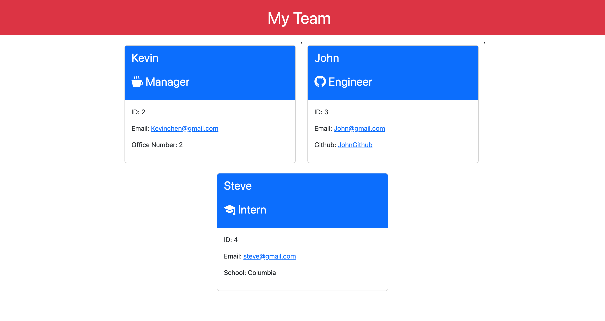

# Team-Profile-Generator

## Description

Team Profile Generator is a application that lets manager generate a website and see the team's basic informations like ids, email, Github profiles, and schools.

## Installation

Node.js

## Link

https://github.com/realkevinC/Team-Profile-Generator 
https://drive.google.com/file/d/1xXV01GwdaEfMBHwH90n57XxXbViYFsVs/view?usp=sharing
 

## Usage

In the command-line user will run node index.js in the Team-Profile-Generator folder. User will the be prompt to answer multiple question when done user will select "not add another team member". Afterward user will be prompted message that "Your team page is built. Check the teamBuilt.html"

## Credits

Kevin

## License

Please refer to the LICENSE in the repo.
